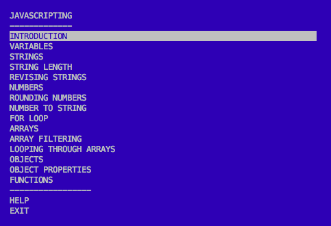

# js-lab-01
Learn Javascripting (JS Core Concepts)

## Tasks
- [x] Open Terminal
  * Mac: Cmd + Space, type terminal and press enter.
  * Win: Win + R, type cmd and press enter.
- [x] Install Lab Instructions
  ```bash
  $> cd ~ && cd Desktop
  $> mkdir lastname_js_lab_01 && cd lastname_js_lab_01
  $> npm install -g javascripting
  $> javascripting
  # The JavaScripting lab menu is now visible! If it's not, please seek assistance from your instructor.
  ```
  * You'll see the menu:
  
  
- [x] Setup Coding Environment
  * Open another terminal then key in ```code .``` to launch VSCode.
  ```bash
  $> cd ~ && cd Desktop\lastname_js_lab_01
  $> code .
  # if last command doesn't work, manually launch a VSCode and open folder ~Desktop/lastname_js_lab_01
  ``` 
- [x] Start learning JS!
- [x] Once you have completed all challenges, submit a compressed file of your code (e.g., lastname_js_lab_01.zip) to Blackboard.
